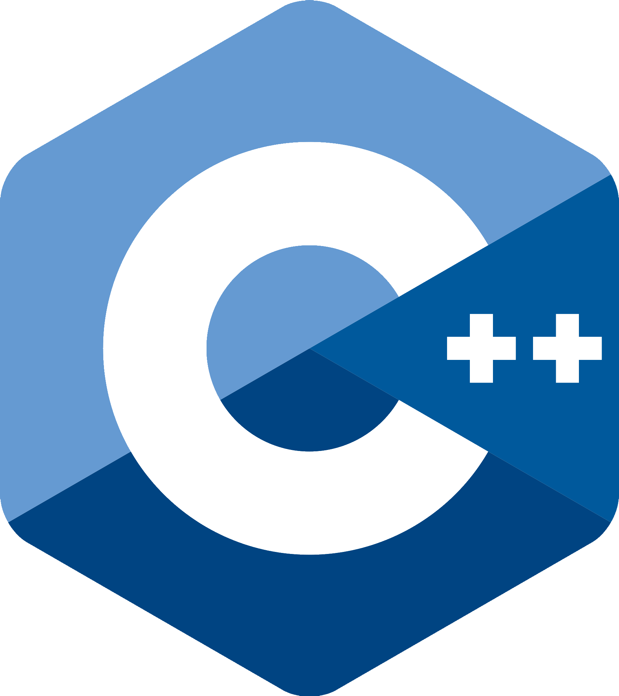
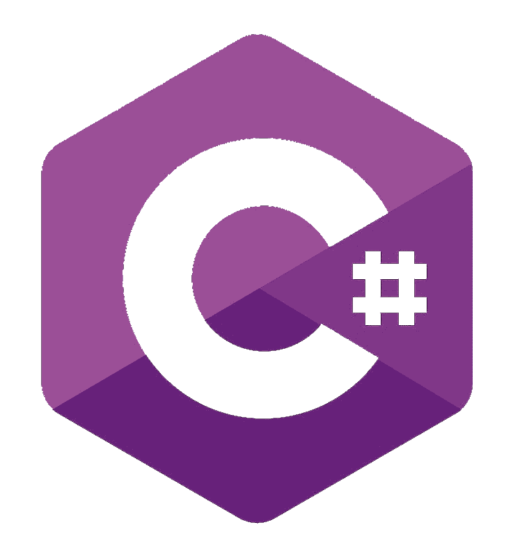
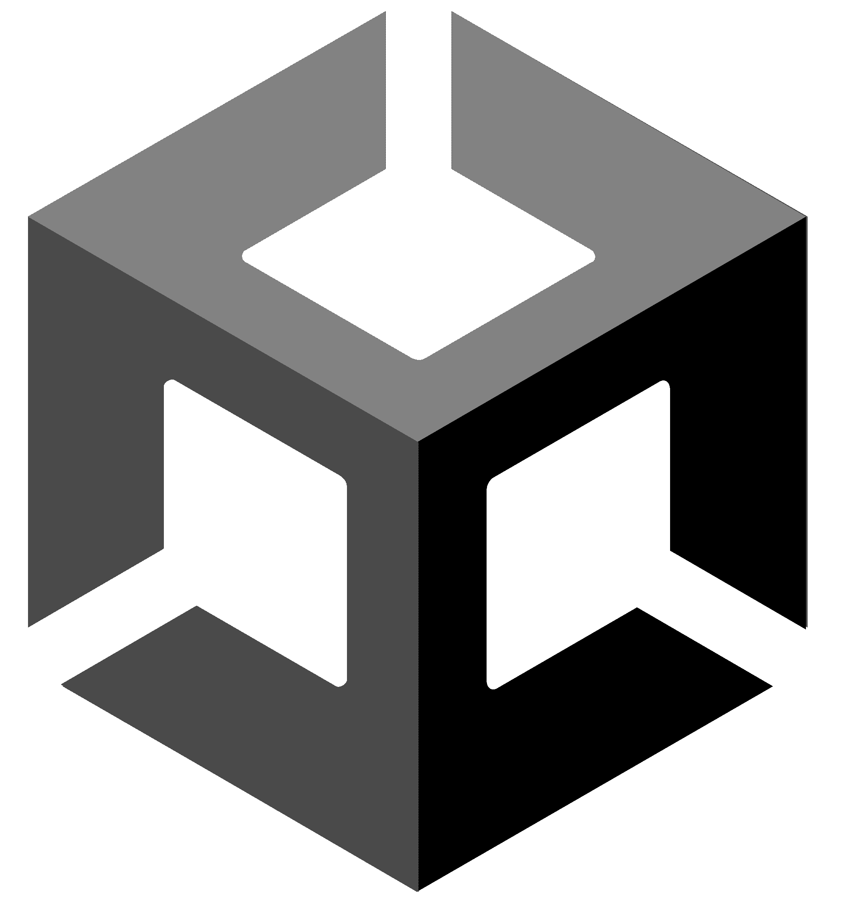

# Hi there, I'm Evan - aka [Smiithyy][instagram] 👋 

## I'm a Developer, Drummer and Gamer!

- 🔭 I am currently working on my portfolio.
- 🌱 I’m currently honing my skills in C++ and Unreal Engine
- 🥅 2022 Goals: Become a full time game developer
- ⚡ Fun fact: I play drums for a metal band called [Avirtue][avirtue]

### Connect with me:

&nbsp;&nbsp;

&nbsp;&nbsp;

&nbsp;&nbsp;

&nbsp;&nbsp;

### Languages and Tools:

 
 

[instagram]: https://www.instagram.com/evansmith.drums
[avirtue]: https://www.instagram.com/avirtue.band
[email]: mailto:evansmith.software@gmail.com
[linkedin]: https://www.linkedin.com/in/smiithyy
[steam]: steamcommunity.com/id/Smiithyy
[twitch]: https://www.twitch.tv/smiithyy__
